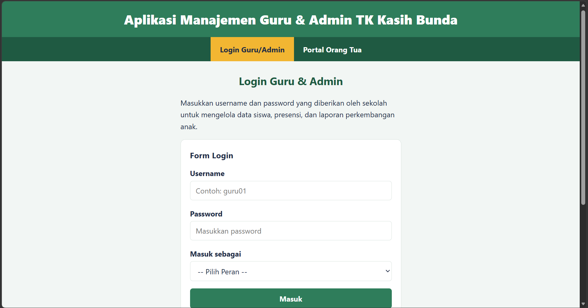
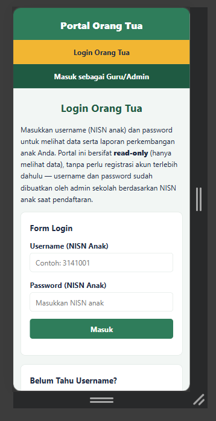

# Aplikasi Manajemen Guru & Admin TK Kasih Bunda

Tugas Minggu 3 (BAB 3 - CSS), melanjutkan struktur HTML dari Tugas Minggu 2. Tampilan dibuat dengan satu file `style.css` (CSS native, tanpa framework) yang dihubungkan ke seluruh halaman.

## Daftar Halaman
| File | Keterangan |
|---|---|
| `index.html` | Daftar siswa dan kelas |
| `form.html` | Form tambah / edit data siswa |
| `detail.html` | Detail siswa (profil, presensi, laporan perkembangan) |
| `login-guru.html` | Login guru dan admin |
| `login-ortu.html` | Login orang tua |
| `portal-ortu.html` | Portal orang tua (read-only) |
| `style.css` | Stylesheet bersama untuk semua halaman |

## Penerapan CSS
- **Font properties:** `font-family`, `font-size`, dan `font-weight` diatur untuk judul (`h1`-`h3`) dan teks isi, konsisten di semua halaman.
- **Styling list:** menu navigasi (`ul` di dalam `nav`) tampil tanpa bullet sebagai menu horizontal, dengan efek hover dan penanda halaman aktif.
- **Alignment teks:** `text-align` untuk judul halaman, header, footer, caption tabel, label form, dan teks tabel.
- **Warna konsisten:** palet hijau, kuning, dan navy didefinisikan sebagai CSS variables di `:root` untuk background dan teks.
- **`
` dan ``:** `div` untuk `.profil`, `.galeri`, dan `.bungkus-tabel`; `span` untuk label status (`.badge`) seperti Hadir, Izin, dan status perkembangan.

## Responsive (@media query)
Pada layar dengan lebar maksimal 768px (`@media (max-width: 768px)`):
1. Navigasi berubah dari horizontal menjadi vertikal.
2. Foto profil dan tabel identitas yang berdampingan menjadi bertumpuk.

## Screenshot
### Desktop

### Mobile

## Pembuat
Rosa Ardila — S1 Rekayasa Perangkat Lunak, Universitas Telkom
